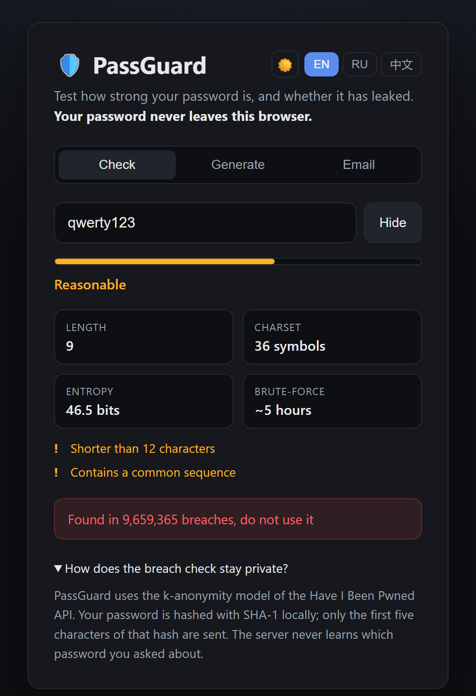

# 🛡️ PassGuard

**Языки:** [English](README.md) · **Русский** · [中文](README.zh.md)

[](https://github.com/Ka1nnnn/passguard/actions/workflows/ci.yml)
[](https://github.com/Ka1nnnn/passguard/actions/workflows/deploy.yml)
[](LICENSE)


Приватный **набор инструментов для паролей**, работающий полностью в браузере. Три вкладки:

- **Проверка** - оценка энтропии и времени взлома пароля + проверка на утечку (через k-анонимность - пароль не покидает браузер).
- **Генерация** - создание надёжных паролей: длина ползунком, переключатели классов символов, экспорт до 200 штук сразу в `.txt`/`.md`.
- **Почта** - проверка адреса электронной почты по известным утечкам с подробностями о том, что именно было слито.

### 🔗 [Живая демонстрация](https://Ka1nnnn.github.io/passguard/)

| Проверка | Генерация | Почта |
|:--:|:--:|:--:|
|  |  |  |

---

## ✨ Возможности

- **Индикатор надёжности в реальном времени** - энтропия в битах, размер алфавита и оценка времени перебора.
- **Проверка пароля по утечкам через k-анонимность** - использует API [Have I Been Pwned](https://haveibeenpwned.com/API/v3#PwnedPasswords); пароль хешируется локально, в сеть уходят только первые 5 символов SHA-1-хеша.
- **Генератор паролей** - криптостойкий ГПСЧ, регулируемая длина, выбор классов символов, опция «в конце заглавная буква и `-`/`_`».
- **Пакетный экспорт** - до 200 паролей за раз: скопировать все или скачать в `.txt`/`.md` (полностью локально - лимиты API не тратятся).
- **Проверка почты на утечки** - сверяет адрес с [XposedOrNot](https://xposedornot.com/) и показывает риск-скор и детали по каждой утечке (дата, число записей, какие данные слиты).
- **Светлая/тёмная тема** - переключатель в шапке; выбранные тема и язык запоминаются между визитами.
- **Мультиязычный интерфейс** - английский, русский и китайский, переключение на лету.
- **Ноль зависимостей** - чистый HTML/CSS/JS, без сборки, без бэкенда, бесплатный статический хостинг.
- **Покрыт тестами** - чистая логика проверена 27 юнит-тестами и CI.

## 🔒 Как работает приватная проверка пароля

«В лоб» проверять пароль по базе утечек означало бы *отправлять пароль на сервер* - именно то, чего делать нельзя. PassGuard избегает этого с помощью модели **k-анонимности**:

1. Пароль хешируется алгоритмом **SHA-1 прямо в браузере**.
2. На сервер отправляются только **первые 5 символов** хеша.
3. API возвращает **все** хеши из утечек с таким префиксом (их сотни).
4. Браузер сам сверяет оставшиеся 35 символов **локально**.

Таким образом сервер никогда не узнаёт, какой пароль - и даже какой полный хеш - вы проверяли.

> **Про проверку почты:** при проверке email адрес **отправляется** в API XposedOrNot - k-анонимность для почты невозможна. В интерфейсе об этом честно сказано. K-анонимна только проверка паролей.

## 🚀 Запуск локально

Сборка не нужна. Поскольку используются ES-модули, открывайте через HTTP (а не `file://`):

```bash
# склонируйте репозиторий, затем из папки проекта:
python -m http.server 8000
# откройте http://localhost:8000
```

## 🧪 Тесты

Логика силы, генератора, экспорта и разбора ответа почты не имеет зависимостей и покрыта тестами на встроенном раннере Node:

```bash
node --test
```

## 📁 Структура проекта

```
passguard/
├── index.html          # разметка (3 вкладки)
├── styles.css          # стили
├── src/
│   ├── strength.js     # энтропия, оценка, время взлома (чистая логика, тесты)
│   ├── hibp.js         # SHA-1 + проверка пароля по k-анонимности
│   ├── generate.js     # генератор паролей на CSPRNG (чистая логика, тесты)
│   ├── download.js     # сборка и скачивание .txt/.md
│   ├── email.js        # проверка почты через XposedOrNot + разбор ответа
│   ├── i18n.js         # строки EN/RU/ZH + локализованный формат
│   └── app.js          # связка с DOM
├── test/               # тесты strength / generate / download / email
└── .github/workflows/  # CI + деплой на GitHub Pages
```

## ⚠️ Дисклеймер

PassGuard - учебный инструмент. Оценка энтропии теоретическая, а реальный злоумышленник может применять более умные словарные методы. Данные об утечках берутся из сторонних сервисов и могут быть неполными. Пользуйтесь менеджером паролей и уникальными паролями везде.

## 📄 Лицензия

[MIT](LICENSE)
