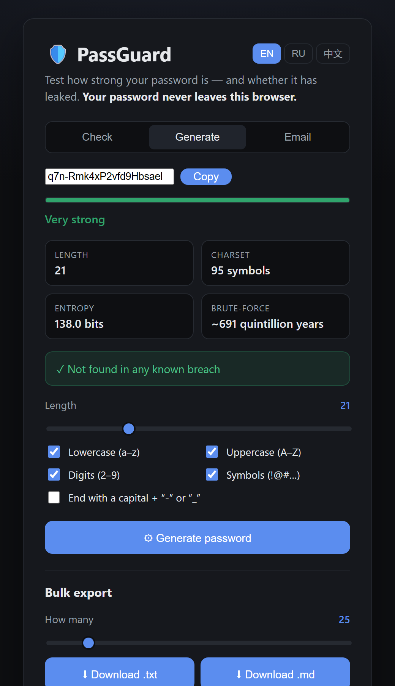
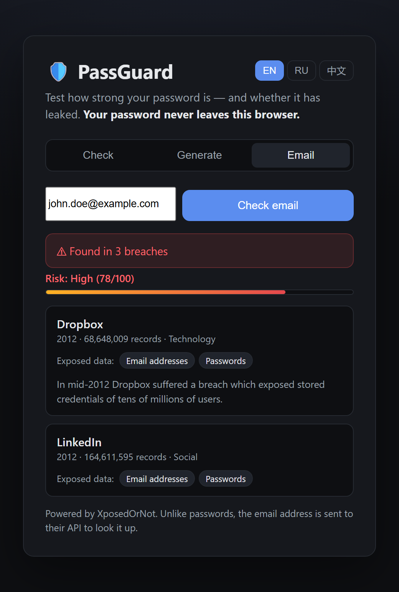

# 🛡️ PassGuard

**语言：** [English](README.md) · [Русский](README.ru.md) · **中文**

[](https://github.com/Ka1nnnn/passguard/actions/workflows/ci.yml)
[](https://github.com/Ka1nnnn/passguard/actions/workflows/deploy.yml)
[](LICENSE)


一个完全在浏览器中运行、注重隐私的**密码工具箱**。三个标签页：

- **检测** —— 评估密码的熵和破解时间，并检查是否泄露（通过 k-匿名 —— 密码绝不离开浏览器）。
- **生成** —— 用滑块调节长度、用开关选择字符类型，生成高强度密码，并可一次导出最多 200 个为 `.txt`/`.md`。
- **邮箱** —— 用已知数据泄露检查邮箱地址，并显示具体泄露了哪些数据。

### 🔗 [在线演示](https://Ka1nnnn.github.io/passguard/)

<p align="center">
  
  
</p>

---

## ✨ 功能

- **实时强度指示器** —— 以比特表示的熵、字符集大小，以及预估的暴力破解时间。
- **基于 k-匿名的密码泄露检测** —— 使用 [Have I Been Pwned](https://haveibeenpwned.com/API/v3#PwnedPasswords) API；密码在本地哈希，只有 SHA-1 哈希的前 5 个字符会离开浏览器。
- **密码生成器** —— 密码学安全的随机数生成器、可调长度、可选字符类型，并可选择以大写字母加 `-`/`_` 结尾。
- **批量导出** —— 一次生成最多 200 个密码并下载为 `.txt` 或 `.md`（完全本地 —— 不消耗任何 API 限额）。
- **邮箱泄露查询** —— 通过 [XposedOrNot](https://xposedornot.com/) 检查地址，显示风险评分及每次泄露的详情（日期、记录数、泄露的数据类别）。
- **多语言界面** —— 英语、俄语和中文，可即时切换。
- **零依赖** —— 纯 HTML/CSS/JS，无需构建，无后端，免费静态托管。
- **已测试** —— 纯逻辑由 27 个单元测试和 CI 覆盖。

## 🔒 隐私密码泄露检测的工作原理

直接用泄露数据库检查密码意味着*把密码发送到服务器* —— 这正是绝不应该做的事。PassGuard 通过 **k-匿名** 模型避免了这一点：

1. 密码在**浏览器中用 SHA-1 哈希**。
2. 只有该哈希的**前 5 个十六进制字符**被发送到 API。
3. API 返回**所有**共享该前缀的泄露哈希（数以百计）。
4. 你的浏览器在**本地**比对剩余的 35 个字符。

因此服务器永远不会知道你查询的是哪个密码 —— 甚至不知道是哪个完整哈希。

> **关于邮箱检查：** 邮箱查询**会**将地址发送到 XposedOrNot API —— 邮箱无法使用 k-匿名。界面对此有明确说明。只有密码检查是 k-匿名的。

## 🚀 本地运行

无需构建工具。由于使用了 ES 模块，请通过 HTTP 提供服务（而非 `file://`）：

```bash
# 克隆仓库后，在项目目录下：
python -m http.server 8000
# 打开 http://localhost:8000
```

## 🧪 测试

强度、生成器、导出和邮箱解析逻辑无依赖，并使用 Node 内置测试运行器进行单元测试：

```bash
node --test
```

## 📁 项目结构

```
passguard/
├── index.html          # 标记（3 个标签页）
├── styles.css          # 样式
├── src/
│   ├── strength.js     # 熵、评分、破解时间（纯逻辑，已测试）
│   ├── hibp.js         # SHA-1 + k-匿名密码泄露查询
│   ├── generate.js     # 基于 CSPRNG 的密码生成器（纯逻辑，已测试）
│   ├── download.js     # 构建并下载 .txt/.md
│   ├── email.js        # XposedOrNot 邮箱泄露查询 + 解析
│   ├── i18n.js         # EN/RU/ZH 字符串 + 本地化格式
│   └── app.js          # DOM 绑定
├── test/               # strength / generate / download / email 测试
└── .github/workflows/  # CI + GitHub Pages 部署
```

## ⚠️ 免责声明

PassGuard 是一个教育工具。熵值是理论估计，真正的攻击者可能使用更聪明的字典方法。泄露数据来自第三方服务，可能并不完整。请在各处使用密码管理器和唯一的密码。

## 📄 许可证

[MIT](LICENSE)
